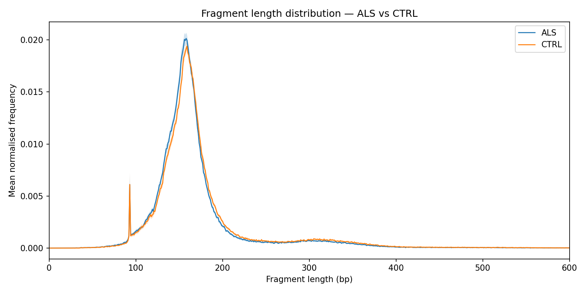
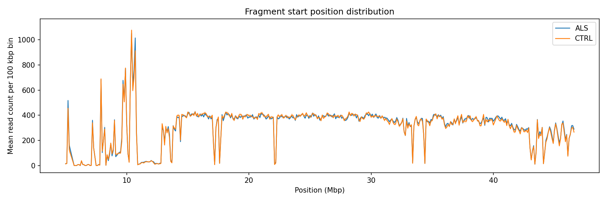
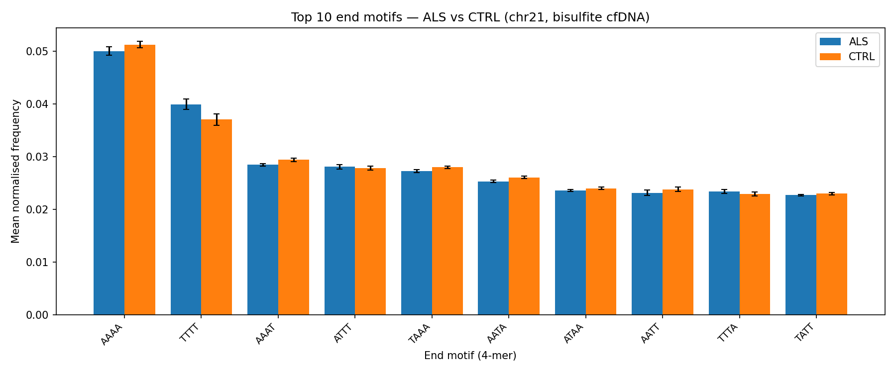
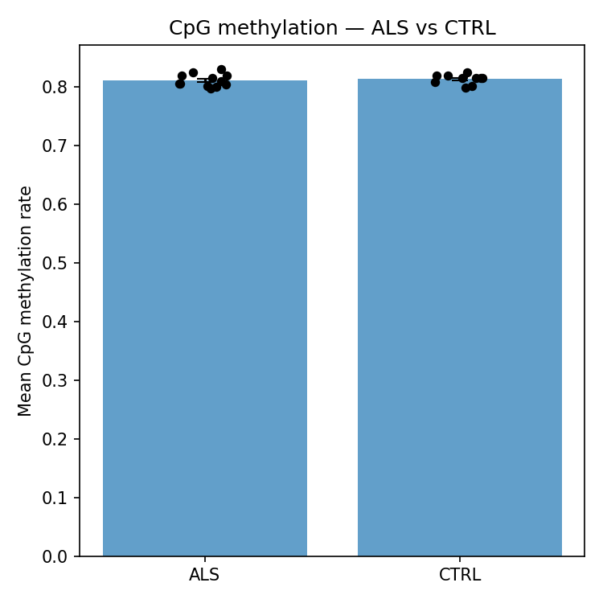

# Analysis Results

Results from running the pipeline on the chr21 cohort: 22 samples (12 ALS, 10 CTRL), bisulfite-sequenced cfDNA.

---

## Fragment length distribution



A mono-nucleosomal peak at ~167 bp is visible in both groups. ALS samples show a higher mono-nucleosomal / di-nucleosomal ratio (`fl_ratio_mono_di`), the strongest discriminating feature in this dataset (effect size 0.84).

---

## Read position distributions




Distribution of fragment 5′ start and 3′ end positions across chr21 in 100 kbp bins. Peaks correspond to regions with higher read depth; troughs reflect low-mappability regions (centromere, pericentromeric repeats). The two groups track closely, with no strong regional enrichment distinguishing ALS from CTRL on chr21.

---

## End-motif distribution



Frequencies of the top end 4-mers (5′ end of each cfDNA fragment). The end-motif spectrum reflects nuclease preference (DNase I, CAD). Bisulfite conversion biases the distribution toward T/A-rich motifs and compresses inter-sample variance.

---

## Methylation summary



Coverage-weighted mean methylation per sample. chr21 is constitutively methylated across both groups so methylation features contribute negligible discriminative signal in this cohort.

---

## Feature contributions

Running LOO-CV with methylation features excluded raises accuracy from 0.64 to 0.68 (macro F1 0.62 → 0.66). The per-feature effect sizes confirm the cause:

| Feature | ALS mean | CTRL mean | Effect size (Cohen's d) |
|---|---|---|---|
| `fl_ratio_mono_di` | 16.3 | 12.7 | 0.84 |
| `fl_std` | 57.2 | 64.2 | 0.57 |
| `fl_mean` | 169.8 | 175.6 | 0.53 |
| `fl_frac_nucleosomal` | 0.797 | 0.775 | 0.48 |
| `methylation_entropy` | 0.0187 | 0.0187 | 0.01 |
| `methylation_median` | 1.000 | 1.000 | 0.00 |

Effect size is Cohen's d: `abs(mean_ALS - mean_CTRL) / pooled_sd`, where `pooled_sd = sqrt(((n1-1)*s1^2 + (n2-1)*s2^2) / (n1+n2-2))`.

`methylation_median = 1.0` for both groups: the majority of covered CpG sites on chr21 are fully methylated in every sample. chr21 is dominated by satellite repeats and constitutive heterochromatin that are uniformly methylated regardless of disease state. Including the methylation features adds five near-zero-signal dimensions to a 27-feature space with n=22, and the regulariser cannot fully suppress them.

Methylation features are retained in the code because they may carry genuine signal in full-genome runs (differentially methylated regions in promoters, enhancers, imprinted loci) and add little computational overhead at extraction time.

---

## Classification

LOO-CV with L2 logistic regression (inner `GridSearchCV` for regularisation strength):

| | All features | Fragment-only |
|---|---|---|
| **Accuracy** | 0.64 | 0.68 |
| **Macro F1** | 0.62 | 0.66 |

ALS **sensitivity** (recall) is **75%** — the model identifies 9 of 12 ALS cases. **Specificity** (CTRL recall) is **50%** — it correctly labels 5 of 10 controls. ALS **precision** is **64%**: of samples called ALS, 64% are true positives. These metrics reflect the chr21 limitation: with no ALS-specific signal on chr21, the classifier is working largely from global cfDNA biology, and the regulariser is under-constrained at n=22.

Full classification report (all-features run):

```
              precision    recall  f1-score   support

         als       0.64      0.75      0.69        12
        ctrl       0.62      0.50      0.56        10

    accuracy                           0.64        22
   macro avg       0.63      0.62      0.62        22
weighted avg       0.63      0.64      0.63        22
```

Fragment length features drive classification; methylation features add noise on chr21. See [Classification Methodology](classification.md) for the full methodology and leakage-prevention details.

!!! note "Chr21 scope"
    Chr21 is ~1.5% of the autosomal genome. Extending to the full genome is expected to increase classification power, particularly for methylation features which are uninformative here but may carry genuine signal at promoters, enhancers, and imprinted loci elsewhere.

---

## Downloads

- [sample_summary.csv](assets/results/sample_summary.csv) — per-sample extracted features (fragment length, methylation statistics)
